# 🌍 Ecosistema Viaje con Inteligencia

> Radar de seguridad global impulsado por IA, OSINT y datos oficiales.

## Diagrama de Arquitectura

```mermaid
flowchart TB
    subgraph Sources["📡 Fuentes de Datos"]
        MAEC["🇪🇸 MAEC<br/>Ministerio Exteriores"]
        USDOS["🇺🇸 US State Dept<br/>Travel Advisories"]
        GDELT["📊 GDELT<br/>Sentimiento global"]
        RSS["📰 RSS Feeds<br/>AP, BBC, Reuters"]
        REDDIT["🔴 Reddit<br/>r/travel, r/RVLiving"]
        USGS["🌋 USGS<br/>Terremotos"]
        GDACS["⚠️ GDACS<br/>Desastres naturales"]
        OPSKY["✈️ OpenSky<br/>Espacio aéreo"]
        OWTHR["🌤️ OpenWeather<br/>Clima"]
        OIL["🛢️ Oil Price<br/>Brent crude"]
        FLIGHT["🛩️ FlightLabs<br/>Retrasos vuelos"]
        WHO["🏥 WHO<br/>Datos salud"]
        WIKI["📚 Wikidata<br/>POIs"]
        OSM["🗺️ OpenStreetMap<br/>Geodatos"]
    end

    subgraph Pipeline["⚙️ Pipelines (Master Cron 06:00 UTC)"]
        direction TB
        SCRAPE["MAEC Scraper"]
        USDOS_P["US State Dept<br/>Scraper"]
        OSINT["🔍 OSINT Sensor<br/>GDELT + RSS + Reddit"]
        CLASS["🧠 Groq Classifier<br/>Categoriza + Urgencia"]
        TCI["💰 TCI + Oil<br/>Coste viaje"]
        AIR["✈️ Airspace OSINT"]
        FEAT["📐 Feature Store<br/>25 features"]
        ML["🤖 ML Training<br/>Random Forest"]
        PRED["📈 Predictions<br/>4 modelos: score, probUp"]
        SOC["📱 Social Publisher"]
        NEWS["📧 Newsletter Generator"]
        INF["🖼️ Infografía Semanal"]
    end

    subgraph Storage["💾 Supabase Storage"]
        OSIG["osint_signals"]
        INC["incidents"]
        MFEAT["ml_features"]
        MMOD["ml_models"]
        RPRED["risk_predictions"]
        PAIS["paises"]
        IDX["indices"]
        MHIST["maec_risk_history"]
        ERISK["external_risk"]
        EVT["events"]
        UPREF["user_preferences"]
        UW["user_watchlist"]
        TRIPS["trips"]
        PROF["profiles"]
        ALERTS["alerts"]
        NLSUB["newsletter_subscribers"]
        OPLOG["opensky_logs"]
    end

    subgraph APIs["🔌 APIs REST"]
        direction TB
        PUB["Públicas<br/>maec, osint, pois, indices<br/>ml/score, pais/[codigo]"]
        AUTH["Autenticadas<br/>trips, user/*, aviation"]
        AI["AI<br/>chat, itinerary, risk, compare"]
        ADM["Admin<br/>health, cron, trends<br/>reddit-generate, paises"]
    end

    subgraph Frontend["🖥️ Frontend Next.js 16"]
        DIR["/pais/[codigo]<br/>Fichas país"]
        BLOG["/blog<br/>Artículos SEO"]
        DASH["/dashboard<br/>KPIs + Alertas"]
        RADAR["/dashboard/radar<br/>Monitor viajes"]
        PULSO["/pulso-global<br/>Sentimiento global"]
        OSINT_P["/osint<br/>Señales OSINT"]
        ADMIN["/admin/*<br/>Panel control"]
        VIAJES["/viajes<br/>Itinerarios"]
        INFOG["/infografias<br/>Visualizaciones"]
        DIAG["/diagnostico<br/>Health Check"]
        ECO["/ecosistema<br/>Este diagrama"]
    end

    subgraph Social["📱 Distribución Social"]
        TG["Telegram<br/>@ViajeConInteligencia"]
        BS["Bluesky"]
        MAST["Mastodon"]
        REDDIT_P["Reddit<br/>(semi-auto Groq)"]
        EMAIL["Email<br/>Resend"]
    end

    subgraph Ext["🔧 Servicios Externos"]
        GROQ["Groq API<br/>LLM llama-3.3"]
        RESEND["Resend<br/>Email transaccional"]
        FLAB["FlightLabs<br/>Datos vuelos"]
        BING["Bing IndexNow<br/>Indexación"]
    end

    %% Conexiones
    MAEC --> SCRAPE
    USDOS --> USDOS_P
    GDELT --> OSINT
    RSS --> OSINT
    REDDIT --> OSINT
    OSINT --> CLASS
    CLASS --> OSIG
    USGS --> OSINT
    GDACS --> OSINT
    OPSKY --> AIR
    AIR --> OPLOG
    OIL --> TCI
    OWTHR --> TCI

    SCRAPE --> MHIST
    USDOS_P --> ERISK
    OSIG --> FEAT
    MHIST --> FEAT
    ERISK --> FEAT
    TCI --> FEAT
    FEAT --> MFEAT
    MFEAT --> ML
    ML --> MMOD
    MMOD --> PRED
    PRED --> RPRED

    MFEAT --> FEAT
    PAIS --> FEAT
    IDX --> FEAT
    EVT --> FEAT
    UW --> RADAR
    OSIG --> OSINT_P
    INC --> PULSO
    RPRED --> DASH

    MHIST --> PUB
    ERISK --> PUB
    OSIG --> PUB
    PAIS --> PUB
    TRIPS --> AUTH
    UPREF --> AUTH
    PROF --> AUTH
    ALERTS --> ADM
    MMOD --> ADM

    PUB --> Frontend
    AUTH --> Frontend
    AI --> Frontend
    ADM --> ADMIN

    SCRAPE --> SOC
    SOC --> TG
    SOC --> BS
    SOC --> MAST
    SOC --> REDDIT_P
    NEWS --> EMAIL
    INF --> INFOG

    GROQ --> CLASS
    GROQ --> SOC
    RESEND --> EMAIL
    FLAB --> FLIGHT
    BING --> Frontend
```



## Componentes del Ecosistema

### 📡 Fuentes de Datos (14 fuentes activas)

| Fuente | Tipo | Datos | Frecuencia |
|--------|------|-------|------------|
| MAEC | Gobierno | Riesgo viaje 120 países | Diaria (scrape) |
| US State Dept | Gobierno | Travel Advisories + riesgo numérico | Diaria (scrape) |
| GDELT | OSINT | Sentimiento global tone_score | Cada 15min |
| RSS (AP, BBC, Sky) | OSINT | Noticias breaking | Tiempo real |
| Reddit (r/travel, etc.) | OSINT | Experiencias viajeros | Cada 6h |
| USGS | Ciencia | Terremotos tiempo real | Tiempo real |
| GDACS | ONU | Desastres naturales | Tiempo real |
| OpenSky Network | OSINT | Vuelos activos espacio aéreo | Cada 6h |
| OpenWeather | Clima | Datos meteorológicos | Cada 3h |
| Oil Price (Yahoo) | Finanzas | Precio Brent crudo | Diaria |
| FlightLabs | API | Retrasos + estado vuelos | Bajo demanda |
| WHO | Salud | Gasto sanitario, riesgos | Mensual |
| Wikidata | Abierta | Puntos de interés | Estático + refresh |
| OpenStreetMap | Abierta | POIs geolocalizados | Bajo demanda + cache |

### ⚙️ Pipelines (Master Cron · 06:00 UTC · GitHub Actions)

1. **MAEC Scraper** — Scrapea `maec.es` → `maec_risk_history`
2. **US State Dept** — Scrapea `travel.state.gov` → `external_risk`
3. **OSINT Sensor** — GDELT tone_score + RSS + Reddit → clasifica con Groq → `osint_signals`
4. **TCI + Oil** — Actualiza índice coste viaje + precio crudo
5. **Airspace OSINT** — OpenSky para países en conflicto → `opensky_logs`
6. **Feature Store** — Computa 25 features por país → `ml_features`
7. **ML Training** — Random Forest (50 trees, 4 modelos) → `ml_models`
8. **Risk Predictions** — Predice riskScore + probUp 7/14/30d → `risk_predictions`
9. **Social Publisher** — Publica a Telegram, Bluesky, Mastodon
10. **Newsletter** — Digest semanal (lunes) vía Resend
11. **Infografía** — Genera visual semanal (domingos)
12. **Health Check** — Verifica 15 endpoints/servicios

### 💾 Supabase (Base de datos principal)

~30 tablas activas organizadas en:
- **Datos país**: `paises`, `indices`, `maec_risk_history`, `external_risk`
- **Señales OSINT**: `osint_signals`, `incidents`, `events`
- **ML**: `ml_features`, `ml_models`, `risk_predictions`
- **Usuario**: `profiles`, `trips`, `user_preferences`, `user_watchlist`, `alerts`
- **Newsletter**: `newsletter_subscribers`, `newsletter_history`
- **Admin**: `pulso_keywords`, `sentiment_alerts`, `editor_notes`, `opensky_logs`

### 🤖 ML Pipeline (25 features)

**Features base** (20): riskNum, signalCount, incidentCount, changes30d, seasonalMult, gpi_score, gti_score, hdi_score, ipc_score, tci_score, events30d, highImpactEvents30d, usRiskScore, trend7d, trend30d

**Features sentimiento** (5, añadidas May 2026): avgTone7d, avgTone30d, toneTrend7d, negativeRatio7d, toneVolatility7d

**Modelos**: Random Forest Regression (4 salidas)
- `risk_score_rf` — Score compuesto 0-100
- `prob_up_7d_rf` — Probabilidad subida riesgo 7d
- `prob_up_14d_rf` — Probabilidad subida riesgo 14d
- `prob_up_30d_rf` — Probabilidad subida riesgo 30d

### 🖥️ Frontend (Next.js 16 + App Router)

| Ruta | Descripción |
|------|-------------|
| `/` | Homepage + Mapa interactivo + KPIs |
| `/pais/[codigo]` | Ficha completa de país (riesgo, clima, POIs, OSINT) |
| `/blog` | Artículos SEO (112 países) |
| `/dashboard` | Panel usuario (KPIs, alertas, radar) |
| `/dashboard/radar` | Monitor países con timeline proyección |
| `/pulso-global` | Mapa sentimiento global en tiempo real |
| `/osint` | Feed señales OSINT con filtros |
| `/admin/*` | Panel administración (paises, cron, ML, salud) |
| `/viajes` | Planificador de viajes + comparador |
| `/infografias` | Visualizaciones semanales |
| `/comparar` | Comparador de países |
| `/transparencia` | Estado de fuentes |
| `/diagnostico` | Health Check público |
| `/fuentes-osint` | Catálogo de fuentes con atribución |
| `/metodologia` | Metodología de riesgo MAEC |
| `/ecosistema` | Este documento interactivo |

### 📱 Distribución Social

| Canal | Tipo | Contenido | Automatización |
|-------|------|-----------|----------------|
| Telegram | Canal + Bot | Alertas, newsletter, interactivo | 100% automático |
| Bluesky | Social | Posts resumen | Automático vía cron |
| Mastodon | Social | Posts resumen | Automático vía cron |
| Reddit | Foro | Posts semi-auto (Groq genera, admin revisa) | Semi-automático |
| Email | Newsletter | Digest semanal vía Resend | Automático (lunes) |
| RSS | Feed | Blog + alertas | Automático |
| Bing IndexNow | Indexación | Notifica cambios | Automático post-deploy |

### 🔧 Servicios Externos

| Servicio | Uso | Plan |
|----------|-----|------|
| Groq API | Clasificación OSINT + generación contenido | Gratuito (llama-3.3-70b) |
| Supabase | Base de datos + Auth | Hobby (gratuito) |
| Resend | Email transaccional | Gratuito (3000/mes) |
| Vercel | Hosting + Serverless | Hobby (gratuito) |
| GitHub Actions | Cron diario | Gratuito |
| FlightLabs | Datos vuelos | RapidAPI (free tier) |
| OpenSky Network | Datos espacio aéreo | Gratuito (sin API key) |
| OpenWeather | Datos clima | Gratuito |
| Bing IndexNow | Indexación rápida | Gratuito |

## Métricas Clave

- **120 países** monitorizados con riesgo MAEC
- **14 fuentes** de datos activas
- **25 features** para ML
- **4 modelos** Random Forest entrenados diariamente
- **~30 tablas** en Supabase
- **112+ artículos** SEO publicados
- **15 health checks** ejecutados diariamente
- **~97s** duración master cron completo

## 🆓 vs 💎 Gratuito vs Premium

| Funcionalidad | Gratuito | Premium | Dónde |
|---|---|---|---|
| Riesgo MAEC 120 países | ✅ | ✅ | `/pais/[codigo]` |
| Mapa interactivo KPIs | ✅ | ✅ | `/` |
| Blog SEO viajes | ✅ | ✅ | `/blog` |
| Pulso Global sentimiento | ✅ | ✅ | `/pulso-global` |
| Feed OSINT público | ✅ | ✅ | `/osint` |
| Chat IA viajes | ✅ (llama-3.1-8b) | ✅ (llama-3.3-70b) | `/chat` |
| Radar de Viaje | ✅ (10 países) | ✅ (20 países) | `/dashboard/radar` |
| ScoreBadge ML | ⚠️ (score básico) | ✅ (score completo + probs) | Fichas país |
| Infografías semanales | ✅ (7d delay) | ✅ (tiempo real) | `/infografias` |
| Newsletter semanal | ✅ | ✅ | Footer |
| Alertas personalizadas | ✅ (web) | ✅ (web + Telegram) | Dashboard |
| Comparador países | ✅ | ✅ | `/comparar` |
| Itinerarios IA | ✅ (1 activo) | ✅ (ilimitados) | `/viajes` |
| Check-list viaje | ✅ (básico) | ✅ (completo) | `/checklist` |
| Predicciones ML riesgo | ❌ | ✅ | Dashboard premium |
| Análisis temporal CV | ❌ | ✅ | Dashboard premium |
| Score por perfil viajero | ❌ | ✅ | Fichas país |
| OSINT avanzado (Groq) | ❌ | ✅ | `/osint` filtros premium |
| API pública | ⚠️ (limitada) | ✅ (completa) | `/api-endpoints` |
| Modo Emergencia | ✅ | ✅ | Footer / SOS flotante |
| Destinos alternativos ML | ❌ | ✅ | Fichas país |
| Planificador rutas | ✅ | ✅ | `/rutas/planificar` |
| Proyección 12 meses radar | ✅ | ✅ | `/dashboard/radar` |
| Catálogo seguros | ✅ | ✅ | `/coste/seguros` |

## 📣 Marketing — Claves del Ecosistema

### Diferenciadores únicos (ninguna otra web de viajes lo ofrece)
1. **14 fuentes de datos vivas** combinadas en un solo panel — MAEC + US State Dept + GDELT + OSINT en tiempo real
2. **ML de riesgo con sentimiento** — 25 features, 4 modelos RF, actualización diaria. La única plataforma que predice *probabilidad de subida de riesgo* a 7/14/30 días
3. **5 features de sentimiento** — Analizamos el *tono emocional* de las noticias (GDELT tone_score) como señal temprana de deterioro
4. **Radar de Viaje con timeline** — Proyección de riesgo ajustada por estacionalidad con tus fechas marcadas
5. **15 health checks diarios** — Transparencia total del sistema. Cada pipeline monitorizado
6. **100% gratuito sostenible** — Sin anuncios. Sin muros de pago agresivos. Premium es opcional para ML avanzado

### Argumentario para outreach
```
🔍 "Detectamos riesgos antes que MAEC usando IA + 14 fuentes OSINT."
📊 "25 variables por país, 4 modelos ML, actualización diaria."
🆓 "Todo gratis. Premium solo para ML predictivo avanzado."
🔗 "viajeinteligencia.com/ecosistema — arquitectura pública y transparente."
```

### Frases para RRSS / Landing
- "No esperes a que MAEC actualice. Nosotros detectamos el deterioro antes con IA y 14 fuentes."
- "25 features de riesgo por país. 4 modelos ML. 0 anuncios."
- "La única plataforma que te dice la probabilidad de que un país empeore en 7, 14 y 30 días."
- "Transparencia radical: 15 health checks públicos. Todos los pipelines monitorizados."
- "Tu radar de viaje con proyección: ¿qué riesgo tendrá Tailandia en agosto?"

## Cómo mantener este documento

Al añadir una nueva funcionalidad:
1. Añadir la fuente/pipeline al diagrama Mermaid si aplica
2. Actualizar la tabla de componentes correspondiente
3. Actualizar métricas clave si cambia algún número
4. Actualizar tabla 🆓 vs 💎 si cambia el modelo freemium

---

> Documento mantenido como parte del repositorio. Versión: Mayo 2026 · 25 features · 14 fuentes · 4 modelos RF.
