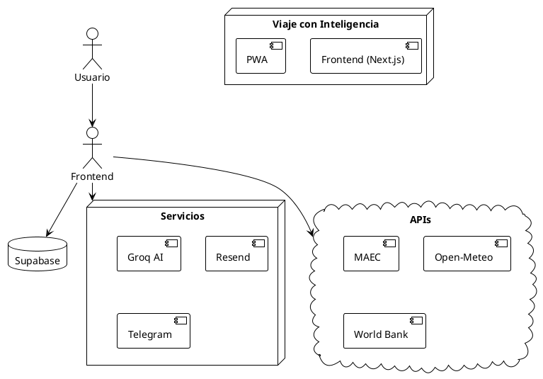
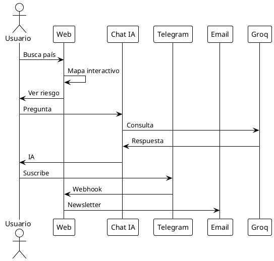

```{=org}
#+STARTUP: content
```
# 

**Viaje con Inteligencia** es la primera plataforma en español que
agrega información oficial de riesgos de viaje de 100 países, combinando
datos del MAEC español, inteligencia artificial y fuentes OSINT en
tiempo real.

---

****Versión:**** 2.0 (Abril 2026) ****Web:****
<https://viajeinteligencia.com> ****Autor:**** M. Castillo
****Contacto:**** info@viajeinteligencia.com

---

# RESUMEN EJECUTIVO

****El Problema**** Los viajeros españoles carecen de una fuente
actualizada, gratuita y fiable sobre riesgos de viaje por país. La
información oficial del MAEC está dispersa y no hay herramientas que
combinen riesgos con datos turísticos, meteorológicos y de IA.

****La Solución**** Una plataforma web + PWA que integra:

-   \[GRAFICO\] 100 países con nivel de riesgo MAEC
-   \[IA\] Chat IA y generador de itinerarios
-   \[APP\] App instalable (sin app store)
-   \[ALERTA\] Alertas en tiempo real
-   \[DOC\] Herramientas: checklist, reclamaciones PDF, равнилка

****Valor Diferenciador****

-   \[OK\] Única plataforma española con 100 países
-   \[OK\] IA conversacional en español
-   \[OK\] Datos OSINT de fuentes oficiales
-   \[OK\] Herramientas prácticas gratuitas

---

# IMPACTO Y MÉTRICAS

****Alcance****

  Métrica                   Actual   Objetivo Q3 2026
  ------------------------- -------- ------------------
  Países cubiertos          100      120
  Artículos blog SEO        52       80
  Visitantes/mes            \~500    2,000
  Suscriptores newsletter   0        200
  Usuarios Telegram         \~50     500

****Funcionalidades Clave****

-   Mapa interactivo con filtros por riesgo
-   Chat IA con modelo Llama 3.1
-   Generador de itinerarios automático
-   Comparador de países con IA
-   Checklist de 80+ items
-   KPIs Index: 6 capas (GPI, GTI, HDI, IPC, Sismos, MAEC)
-   Memoria de viaje offline (PWA)
-   Generador de reclamaciones PDF
-   Reclamos en tiempo real Telegram

---

# PROPUESTA DE VALOR

****Para el Usuario****

  Necesidad                       Solución
  ------------------------------- -------------------------------
  ¿Es seguro viajar a...?         Mapa riesgos MAEC actualizado
  ¿Qué necesito para el viaje?    Checklist printable
  ¿Cómo planificar itinerario?    IA generadora
  ¿Hay alertas activas?           Notificaciones push
  ¿Puedo confiar en el destino?   KPIs + datos OSINT
  ¿Qué hacer si cancelan?         Generador reclamaciones PDF

****Para el Afiliado/Socio****

-   Programa de afiliados: En desarrollo
-   Datos turismos: World Bank API
-   APIs disponibles: weather, dossier, country-data

---

# PRODUCTOS Y SERVICIOS

****Plan Gratuito****

  Feature
  ------------------
  Mapa 100 países
  Fichas país
  Blog 52 posts
  Checklist básica
  Widget clima
  PWA offline

****Plan Premium (4.99€/mes)****

  Feature
  ----------------------------
  Todo gratis
  Chat IA ilimitado
  Generador itinerarios IA
  Comparador países IA
  KPIs Index completo
  Reclamaciones PDF
  Alertas personalizadas
  Memoria de viaje ilimitada

---

# TECNOLOGÍA

****Stack****

-   Next.js 16 + React 19 + TypeScript
-   Tailwind CSS 4
-   Groq AI (Llama 3.1)
-   Supabase (Auth + DB)
-   Vercel (Hosting + Cron)
-   Resend (Email)
-   Telegram API

****Fuentes OSINT****

  Fuente        Datos
  ------------- -------------------
  MAEC España   Riesgos oficiales
  World Bank    PIB, turismo
  Open-Meteo    Meteorología
  IEP           GPI, GTI
  USGS          Sismos

****APIs Disponibles****

-   /api/ai/chat - Chat Groq
-   /api/ai/itinerary - Itinerario
-   /api/weather/extreme - Clima
-   *api/dossier*\[codigo\] - Dossier
-   /api/country-data - World Bank

---

# MODELO DE NEGOCIO

****Ingresos****

  Fuente             Estado
  ------------------ ---------------
  Premium (Stripe)   Configurar
  Afiliados          En desarrollo
  Donaciones         Pendiente

****Costos****

  Servicio   Costo
  ---------- -----------------
  Vercel     \$0 (free tier)
  Supabase   \$0 (free tier)
  Resend     \$0 (free tier)
  Groq       \$0 (free tier)

****Total:**** \$0/mes (infraestrutura gratuita)

---

# COMPETENCIA

  Competidor    Diferenciador
  ------------- ----------------------
  政府在安全    Solo riesgo político
  Traveldocq    No tiene IA
  Skyscanner    Solo vuelos
  TripAdvisor   Reseñas usuario

**Viaje con Inteligencia** es el único con:

-   \[OK\] IA conversacional en español
-   \[OK\] Comparador con IA
-   \[OK\] Generador itinerarios IA
-   \[OK\] Reclamaciones PDF
-   \[OK\] 100 países con MAEC

---

# GOBIERNO Y OPERACIÓN

****Owner:**** M. Castillo (España)

****Automatizaciones****

-   CRON: scrape MAEC diario
-   CRON: check alertas 8:00
-   CRON: daily digest 00:00
-   Newsletter semanal (lunes)

****Mantenimiento****

-   Backup variables: scripts/backup-env.sh
-   Deploy: GitHub → Vercel automático
-   Errores: Vercel Functions logs

---

# HOJA DE RUTA 2026

****Q2 (Completado)****

-   [x] 100 países
-   [x] Generador reclamaciones PDF
-   [x] PWA optimizado
-   [x] Photo opacity fixed

****Q3 (Planeado)****

-   [ ] Stripe Premium
-   [ ] Programa afiliados
-   [ ] 更多 datos World Bank
-   [ ] Dashboard Analytics

****Q4 (Visión)****

-   [ ] API pública
-   [ ] Webhooks
-   [ ] Expandir LATAM

---

# CONTACTO

  Canal             URL
  ----------------- ---------------------------------
  \[WEB\] Web       <https://viajeinteligencia.com>
  \[EMAIL\] Email   info@viajeinteligencia.com
  \[IA\] Bot        \@ViajeConInteligenciaBot
  📢 Canal          \@ViajeConInteligencia
  \[APP\] GitHub    github.com/mcasrom

---

# LICENCIA Y LEGAL

****MIT License**** - Código abierto

****免责声明****

-   Datos basados en información oficial del MAEC
-   No constituye asesoramiento legal
-   Verificar siempre con embajada antes de viajar

****Datos:****

-   Viaje con Inteligencia © 2026 M. Castillo
-   пользуйте bajo tu responsabilidad

---

# ANEXO: Diagramas

****Arquitectura del Sistema****



****Flujo de Usuario****



---

**NOTAS FINALES**

Este documento resume la plataforma **Viaje con Inteligencia**. Para
documentación técnica detallada, ver
[./TECHNICAL_DOC.org](./TECHNICAL_DOC.org).

Última actualización: Abril 2026
